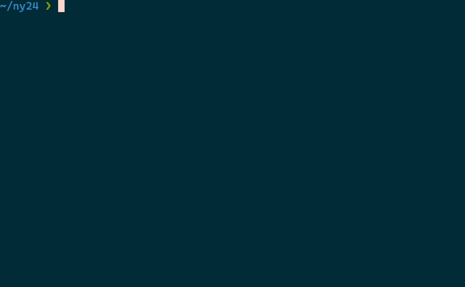

# ny24-anim

  

Animation for celebrating the coming of 2024, presented with [a simple CLI canvas library](./lib/anim.c).

## Usage

Simply `make` and run the executable. The animation will last for 5 seconds.

**Note:** the [shell script](./run.sh) in this repository utilizes `hwclock` and `date` to temporarily skew system time to desired value (that is, `2023-12-31 23:59:58`.) It should be used very carefully since it may cause some system-wide problems related to time synchronization.
